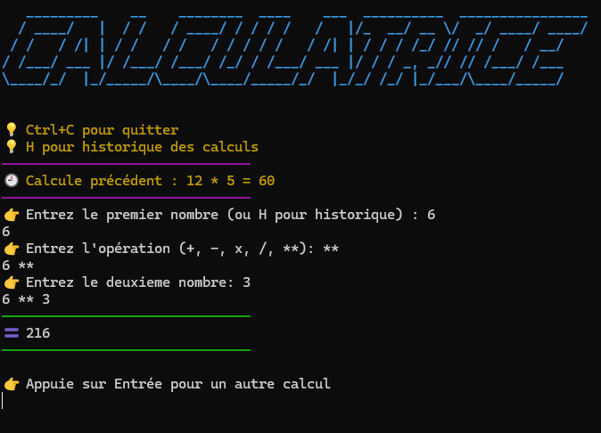

# Python project

A calculator in the terminal:

1) Capable of performing basic calculations (+, -, *, /, **)

2) Error handling

3) Character formatting (x = X = *), (/ = :); (2 2 = 22), etc.

4) A history saved in a JSON file.

