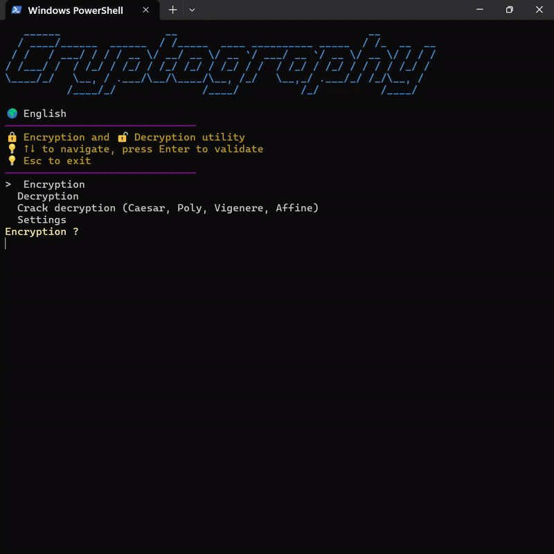

# 🔐 Cryptography CLI Tool

A Python **command-line cryptography application** developed as an **educational and exploratory project**.  
The goal of this project is to **understand classical cryptography**, basic **cryptanalysis techniques**, and how to design a **clean, modular, and user-friendly CLI application**.


---


<p align="center">
  
</p>

## ✨ Implemented Features

### 🔒 Encryption
The following classical encryption methods are fully implemented:

- **Caesar Cipher**
- **ROT family**
  - ROT13
  - ROT18 (letters + digits)
  - ROT47 (printable ASCII)
- **Affine Caesar Cipher**
  - Manual key selection
  - Automatic valid key generation
- **Polyalphabetic Caesar Cipher** (numeric repeating key)
- **Vigenère Cipher**
- **One-Time Pad (OTP)**
  - XOR-based encryption
  - Random key generation
  - Symmetric encryption/decryption

---

### 🔓 Decryption
Decryption is supported at multiple levels of difficulty:

- **Known method + known key**
- **Full brute-force & cryptanalysis** for:
  - Caesar
  - Polyalphabetic cipher
  - Affine cipher
  - Vigenère cipher

The **Vigenère/Poly crack** is the most advanced part of the project and includes:
👉 **This module has its own dedicated documentation:**  
📄 [`Vigenère Cryptanalysis README`](./Cipher/Brut_Force/VIGENERE_CRACK.md)
- Kasiski examination
- Adaptive n-gram detection (bi-grams / tri-grams)
- Frequency analysis on columns
- Dynamic parameter tuning (TOP-N, key length limits)
- Multi-profile cracking strategies
- Dictionary, syllable, and frequency-based scoring
- Hard execution time limit (≤ ~20 seconds)

---

### 📁 File Export System
A dynamic and customizable export system:
- Timestamp-based filenames
- Interactive selection of exported content:
  - ASCII header
  - Cipher method
  - Original text
  - Key
  - Encrypted / decrypted text
  - Date & time
- Only selected elements are written (no unnecessary data)
- Preview before saving

---

### 🧭 User Interface
- Arrow-based navigation (↑ ↓)
- Keyboard controls (Enter / Escape)
- Interactive menus with live updates
- Colored output using **Colorama**
- ASCII titles with **pyfiglet**
- Intro animation
- Full **French / English** support
- Consistent UI across encryption, decryption, and cracking modes

---

### 🏗️ Architecture Highlights
- Clear separation of concerns:
  - Cipher / Decipher / Crack logic
  - UI components
  - Menus
  - Scoring and analysis
- Dispatch-based routing (no massive `if/else`)
- Modular and extensible folder structure
- Procedural & functional design (intentionally no OOP)

---

## ▶️ How to Run

```bash
python main.py
```
---

## 🎯 My Approacht

This is an educational project built to learn Python fundamentals, modular code, and basic cryptography. I intentionally chose **not to use Object-Oriented Programming** in this project I focused on **functional and procedural logic**, clarity, and readability

### Views on AI

I didn’t use AI to generate code.

My workflow is:
1. I **think and struggle first**
2. If I’m blocked, I **search documentation or online resources**
3. Only then do I ask an AI for:
   - detailed explanations
   - conceptual help
   - understanding mistakes or alternative approaches

⚠️ No copy-paste from AI  
Every line of code is written by me, understood, and adapted.

---
### Videos and resources that inspired this project
  (French)
1. https://youtu.be/iy4egJKTKtE?si=1bso1Rhrr243sUay
2. https://youtu.be/0JnC1jJa8C8?si=zRNn1OkSzV_yE8VK
3. https://youtu.be/-gJuGFFTsgo?si=7nvwjWRtHGbvSnib
4. https://youtu.be/f7VBEserHxs?si=TBPUmiPwxEvGXBpR
5. https://youtu.be/mHkTzO6U_Ag?si=8gCDuJsg5jAkgjZ1
6. https://fr.wikipedia.org/wiki/Cryptanalyse_du_chiffre_de_Vigenère
   
  (English)

1. https://youtu.be/QYng_rXg5OQ?si=3wnI6d3UlI4p2KPr
2. https://youtu.be/a64NnBSq8oA?si=awDKOspuVZBUnqve
3. https://www.nsa.gov/Portals/75/documents/news-features/declassified-documents/friedman-documents/publications/FOLDER_258/41761619080075.pdf
